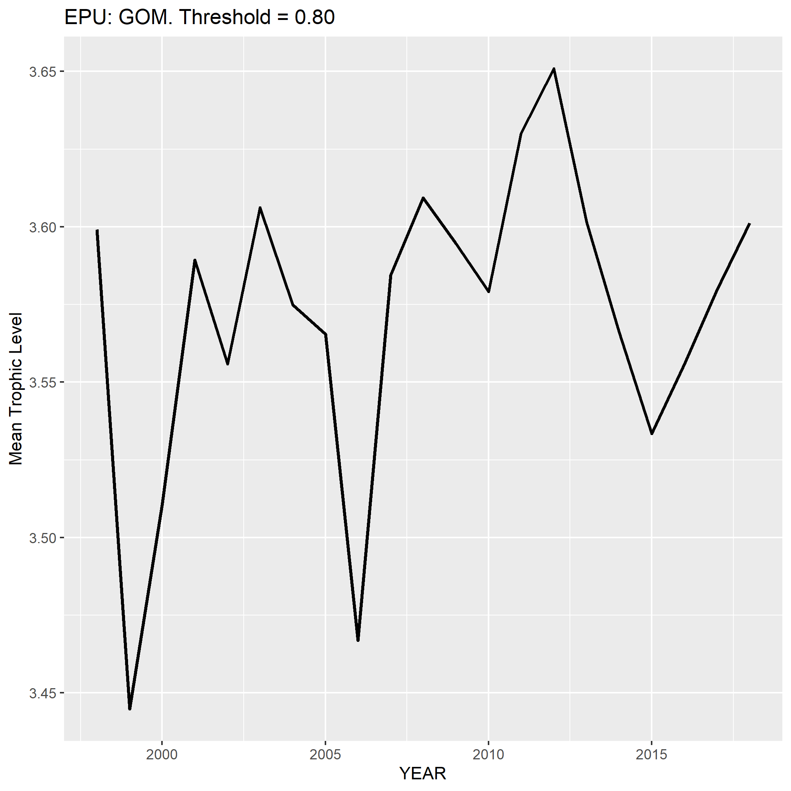
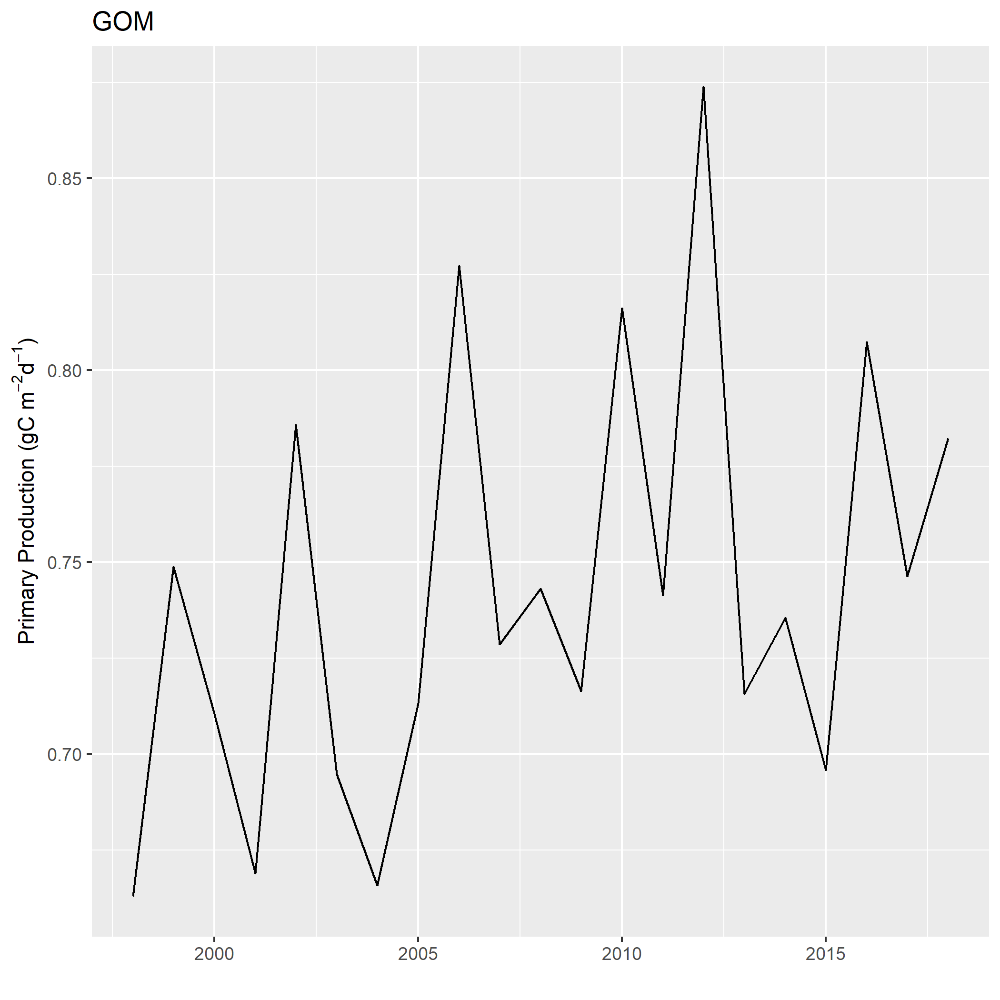

```{r setup, include=FALSE}
knitr::opts_chunk$set(echo = TRUE)
```

This worked example will result in plots of the following for a specified EPU:

* scaled PPR index
* Mean trophic level
* Annual primary production
* species composition over time

The commercial landings data are confidential and are not bundled with this package. This example assumes you have access the the appropriate data base and have already pulled the data and stored it in a dataframe called `comland`. See package `comlandr` for details.

Initial values for the following are needed: 

* threshold - The proportion of landing explained by the species
* transferEff - The transfer efficiency assumed for the PPR index. This is currently fixed for all species
* epu - The region of interest (GOM, GB, MAB)

The data are intially filtered by epu and the landings are aggregated by YEAR for each species (NESPP3 code). A grid is then create for all species in all years

``` {r filterD, eval=F}
library(magrittr)
threshold <- "0.80"
transferEff <- .15
epu <- "GOM" 

## filter landings for designated EPU
landings <- comland %>% dplyr::filter(EPU == epu)  %>% # US and NAFO landings
  dplyr::group_by(YEAR,NESPP3) %>%
  dplyr::summarise(totLand = sum(SPPLIVMT)) %>% 
  dplyr::arrange(YEAR,NESPP3)

landings$totLand <- landings$totLand * 1000000 # convert to grams

# list of unique species codes
nespp3s <- unique(comland$NESPP3)
# expand grid (all species by all years) to include Zeros
completeGrid <- expand.grid(YEAR=min(comland$YEAR):max(comland$YEAR),NESPP3=nespp3s,stringsAsFactors = F)
landingsTable <- dplyr::as_tibble(dplyr::left_join(completeGrid,landings,by=c("YEAR","NESPP3")))


```


The scientific names for each species are obtained by cross referencing cfdbs and svdbs. Then rfishbase is accessed to pull the Trophic level data for each species

```{r scinames, eval=F }
# get species itis, scientific name etc
lookup <- dbutils::create_species_lookup(channel,species=nespp3s)
lookupTable <- lookup$data

# Select distinct species for fishbase ------------------------------------
fishbaseTable <- lookupTable %>% dplyr::select(COMMON_NAME,SCIENTIFIC_NAME,NESPP3) %>%
  dplyr::distinct()
# access fishbase for Trophic level data
callfishbase <- indexPPR::get_trophic_level(fishbaseTable)
fishbaseTable <- callfishbase$fishbaseTable

```

The indices are then calculated over the time range dictated by the landings data.

```{r pprindices, eval = F}
yrs <- min(comland$YEAR):max(comland$YEAR)

# Calculate the indices ---------------------------------------------------
# preallocate
PPR <- data.frame()
MTL <- data.frame()

for (iy in yrs) { #loop

  # filter out categories 
  annualLandings <- landings %>% dplyr::filter(YEAR == iy, !(NESPP3 %in% c("526","529","817","832","806"))) # OTHER FISH, ROCKWEED, SEAWEED, 806 = sea cucumbers
  if ((dim(annualLandings)[1]) == 0) {next}
  # pick species that make up top x % of landings
  topSpecies <- indexPPR::select_top_x_percent(annualLandings$NESPP3,annualLandings$totLand,threshold)
  nSpeciesTop <- dim(topSpecies)[1]
  names(nSpeciesTop) <- "nSpecies"
  topTable <- dplyr::left_join(topSpecies,fishbaseTable,by=c("NESPP3"))

  # set TL values for missing species. User defined function
  topTable <- set_missingTL(topTable)

  # filter the landings by year and species in top x% and aggregate
  landingsTimeSeries <- landingsTable %>% dplyr::filter(NESPP3 %in% unique(topTable$NESPP3),YEAR == iy)
  # total landings for this set of species
  landingsTop <- landingsTimeSeries %>% dplyr::summarise(landings=sum(totLand))
  
  # Calculate the PPR & MTL indices------------------------------------------
  ### NOTE: We do not have discards in calculation, just landings
  ppr_index <- indexPPR::calc_ppr_index(landingsTimeSeries,topTable,transferEff)
  mtl_index <- indexPPR::calc_mtl_index(landingsTimeSeries,topTable)  
  # concatenate  
  PPR <- rbind(PPR,c(ppr_index,nSpeciesTop,landingsTop))  
  MTL <- rbind(MTL,c(mtl_index,nSpeciesTop,landingsTop))
} 
  
```

Primary production info is obtained and the PPR index is scaled by the annual PP to create an index representing proportion of PPR. The indices are shortened to the time frame represented by the PP data

```{r scaledppr, eval = F}
PP <- indexPPR::get_annual_PP(yrs,epu)
scaled <- indexPPR::calc_PPR_scaled(PPR,PP)

MTL <- MTL %>% dplyr::filter(YEAR %in% scaled$YEAR)

```

The indices are then plotted

```{r plotppr, eval = F}
indexPPR::plot_pp_index(scaled,epu)
indexPPR::plot_ppr_index(scaled,epu)
indexPPR::plot_mtl_index(MTL,epu)

```

```{r includeplots1, eval = T, echo = F, out.width='50%'}
knitr::include_graphics("figures/PPR_GOM_0_80.png")


```


## Species composition over time

This will also require a connection to internal oracle databases. A connection object should be created and passed as the variable `channel`

```{r speciescompppr, eval=F}

## filter landings for designated EPU
landings <- comland %>% dplyr::filter(EPU == epu)  %>% # US and NAFO landings
  dplyr::group_by(YEAR,NESPP3) %>%
  dplyr::summarise(totLand = sum(SPPLIVMT)) %>% 
  dplyr::arrange(YEAR,NESPP3)

  speciesComp <- indexPPR::explore_species_composition(channel,landings,as.numeric(threshold),catchCN="totLand")
  # hard code missing species names
  ind <- speciesComp$data$NESPP3 == "524"
  speciesComp$data$COMMON_NAME[ind] <- "OTHER GROUNDFISH"
  ind <- speciesComp$data$NESPP3 == "807"
  speciesComp$data$COMMON_NAME[ind] <- "SQUID,UNC"

  # aggregate all landings by YEAR  
  yearAgg <- speciesComp$data %>% dplyr::group_by(YEAR) %>% dplyr::summarize(totLand=sum(LANDINGS,na.rm = T))
  
}

# Plot species composition
plot(speciesComp$plotObj)

```


```{r plotspeciescomp, echo = F, eval = T, out.width='80%'}
knitr::include_graphics("figures/composition-GOM-0_80.png")
```


